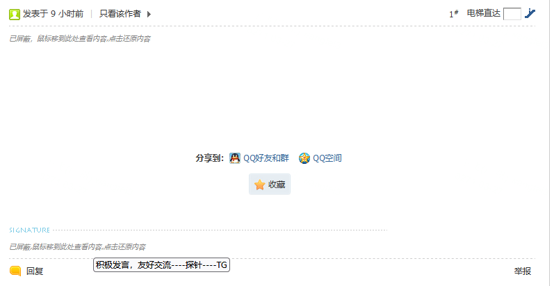

# tampermonkey-scripts
A collection of my tampermonkey scripts

## hostloc-blocker
根据用户名和关键字屏蔽 Hostloc.com 的发帖、回帖、签名

### 设置入口
在帖子列表页和内容页，头像右边显示设置入口

### 设置面板

### 使用效果
- 屏蔽发帖的用户，其发帖和回帖均不可见。
- 屏蔽签名的用户，其签名位置会有灰色斜体文字提示已屏蔽，鼠标移到此处可预览文字，点击恢复显示签名。
- 屏蔽关键字的帖子，在其位置会有灰色斜体文字提示已屏蔽，鼠标移到此处可预览文字，点击恢复显示帖子。

## nodeseek-blocker
根据关键字屏蔽 NodeSeek.com 的发帖。可以和 Nodeseek X 一起使用，对于滚动加载的帖子也有效果。

### 设置面板

## 更新历史
- 2025-10-22
增加了 Nodeseek Blocker

- 2025-10-20
v0.3.0 移除了Pantry API，增加了本地导入导出功能

- 2024-07-22
v0.2.7 修改保存设置后，无需刷新，可立即看到效果。

- 2024-07-17
v0.2.6 修复首次安装时出现的问题，并增加多处提示

- 2024-03-27
v0.2.5 保存到云端时增加了提示。避免还没有保存成功时，用户点击跳转到其他页面，导致保存失败

- 2023-11-10
v0.2.4 取消弹窗，改为控制台输出

- 2022-11-25
v0.2.3 关键字现在不区分大小写了，比如`rn`可以屏蔽RN / rn / Rn / rN

- 2022-07-22
v0.2.2 修复用户不显示签名时，脚本报错的问题;修复还原内容后，title属性未清理的问题

- 2022-07-11
v0.2.1 点击设置面板以外的区域可以关闭面板

- 2022-07-09
v0.2 增加云端同步功能

- 2021-12-09
v0.1 第一版